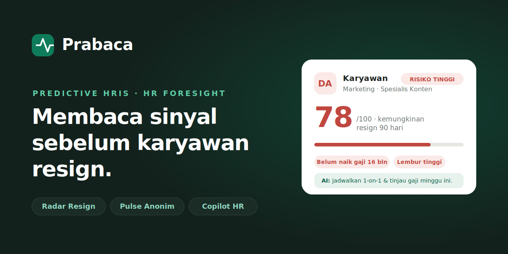

<p align="center">
  
</p>

<p align="center">🇮🇩 Bahasa Indonesia · 🇬🇧 <a href="README.en.md">English</a></p>

# Prabaca — Website Pemasaran


<p align="right"><a href="README.en.md">English</a></p>

> **HRIS yang membaca sinyal sebelum terjadi.**
> Landing page untuk Prabaca, sistem HRIS prediktif yang memberi tahu siapa yang berisiko resign — jauh sebelum surat pengunduran diri masuk.

🔗 **Live demo:** https://juanfakhri.github.io/prabaca-web/ <!-- ganti sesuai nama repo kamu -->

---

## Tentang Prabaca

Kebanyakan HRIS hanya **mencatat masa lalu** — absensi, gaji, dan cuti tersimpan rapi, tapi tetap kamu yang harus menafsirkannya. Prabaca menambah satu lapisan yang belum dimiliki yang lain: **kecerdasan yang membaca masa depan**. Ia membaca pola dari data tim lalu memprediksi risiko dan menyarankan tindakan.

Website ini adalah halaman pemasaran (landing page) yang memperkenalkan produk tersebut.

## Fitur yang ditonjolkan

Tiga kemampuan AI yang menjadi pembeda utama:

- **Radar Resign** — skor risiko resign 90 hari ke depan untuk tiap karyawan, lengkap dengan alasan yang transparan dan rencana intervensi dari AI.
- **Pulse Anonim** — suara jujur karyawan tanpa rasa takut; AI menyamarkan identitas dan merangkumnya menjadi tema, bukan nama.
- **Copilot HR** — asisten yang bisa ditanya pakai bahasa biasa dan langsung membuat draft dokumen HR.

Ditambah modul HRIS lengkap: absensi real-time, cuti & izin dengan deteksi bentrok jadwal, payroll dengan komponen BPJS & PPh 21, rekrutmen, kinerja, dan direktori karyawan.

## Highlight halaman

- Hero dengan kartu **Radar Resign** sebagai visual utama
- Animasi halus saat scroll & menu responsif untuk mobile
- FAQ interaktif (accordion) agar ramah untuk semua kalangan
- Bagian harga, cara kerja, dan ajakan bertindak

## Teknologi

- HTML & CSS murni (tanpa dependensi, tanpa proses build)
- Vanilla JavaScript untuk animasi scroll, menu mobile, dan accordion
- Responsif & mendukung `prefers-reduced-motion`

## Menjalankan secara lokal

Cukup buka `index.html` di browser — tidak perlu instalasi apa pun.

## Deploy ke GitHub Pages

1. Unggah `index.html` ke repo ini (branch `main`).
2. Buka **Settings → Pages**.
3. Pada *Source*, pilih **Deploy from a branch** → branch `main` → folder `/ (root)` → **Save**.
4. Tunggu ~1 menit; situs akan live di `https://<username>.github.io/<nama-repo>/`.

## Struktur

```
.
├── index.html   # Seluruh halaman (HTML + CSS + JS dalam satu file)
└── README.md
```

## Catatan

Ini adalah **konsep produk** untuk keperluan demonstrasi dan portofolio. Nama, harga, dan angka yang ditampilkan bersifat ilustratif.

## Penyusun

**Juan Fakhri** — profil hybrid teknis & HR.

- GitHub: [@JuanFakhri](https://github.com/JuanFakhri)
- LinkedIn: [juan-fakhri](https://linkedin.com/in/juan-fakhri)
- Email: juanfakhri02@gmail.com

---

© 2026 Prabaca · Dibuat sebagai konsep produk.
